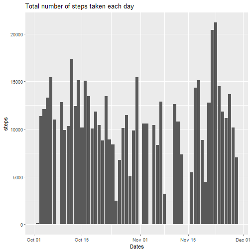
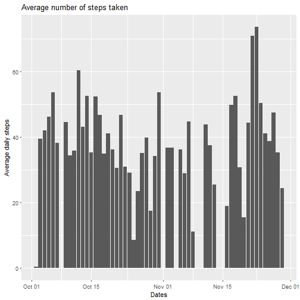
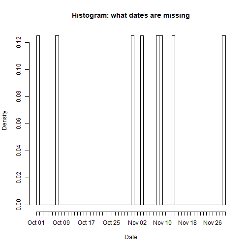
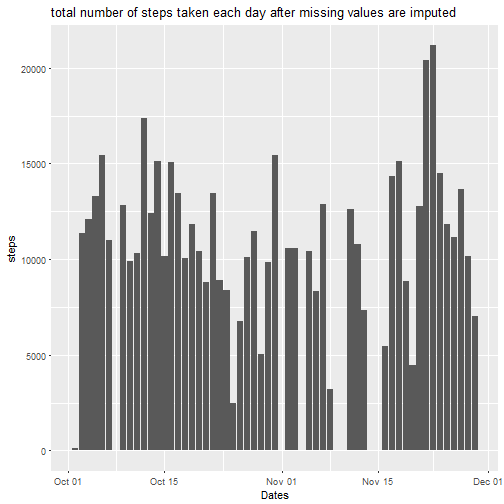
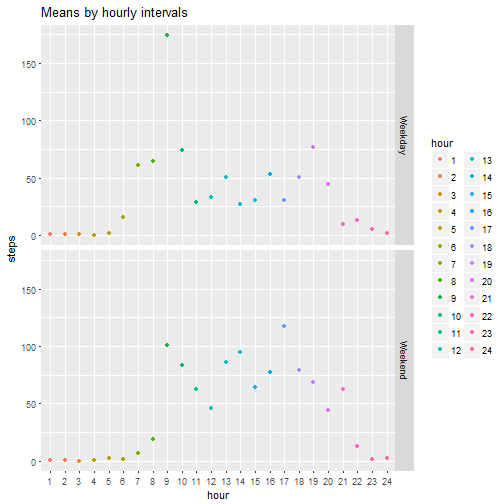
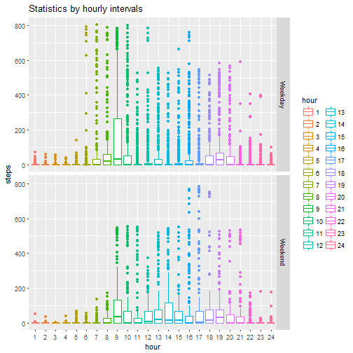

# Activity Statistics

## Getting the data

**<span style="color:blue">1 - Code for reading in the dataset and processing the data</span>**

Let's first download and read the data into a data frame


```r
temp <- tempfile()
download.file("https://d396qusza40orc.cloudfront.net/repdata%2Fdata%2Factivity.zip",temp)
activity <- read.csv(unz(temp, "activity.csv"))
unlink(temp)
```

Some fields have undesired data format:


```r
str(activity)
```

```
## 'data.frame':	17568 obs. of  3 variables:
##  $ steps   : int  NA NA NA NA NA NA NA NA NA NA ...
##  $ date    : Factor w/ 61 levels "2012-10-01","2012-10-02",..: 1 1 1 1 1 1 1 1 1 1 ...
##  $ interval: int  0 5 10 15 20 25 30 35 40 45 ...
```

Let's convert *interval* variable into factor and create a variable *hour* based on intervals:


```r
library(plyr)
activity$hour<-as.factor(round_any((as.numeric(activity$interval)+1)/100, 1, f = ceiling)) # create a variable for each hour
activity$interval<-as.factor(activity$interval)
```

## Exploratory Data Analysis

**<span style="color:blue">2 - Histogram of the total number of steps taken each day</span>**

```r
library(ggplot2)
ggplot(data = activity,
       aes(as.Date(as.character(activity$date), "%Y-%m-%d"), steps)) +
        stat_summary(fun.y = sum, # adds up all observations
                     geom = "bar") +
        xlab ("Dates") +
        ggtitle("Total number of steps taken each day")
```

```
## Warning: Removed 2304 rows containing non-finite values (stat_summary).
```



**<span style="color:blue">3 - Mean and median number of steps taken each day</span>**

Let's create a data frame with means and medians for each day (keeping NAs for now)

```r
means<-ddply(activity, "date", summarise, mean = mean(steps))
medians<-ddply(activity, "date", summarise, median = median(steps))
means_medians<-merge(means,medians)
```

All medians are 0:


```
##          date       mean median
## 1  2012-10-01         NA     NA
## 2  2012-10-02  0.4375000      0
## 3  2012-10-03 39.4166667      0
## 4  2012-10-04 42.0694444      0
## 5  2012-10-05 46.1597222      0
## 6  2012-10-06 53.5416667      0
## 7  2012-10-07 38.2465278      0
## 8  2012-10-08         NA     NA
## 9  2012-10-09 44.4826389      0
## 10 2012-10-10 34.3750000      0
## 11 2012-10-11 35.7777778      0
## 12 2012-10-12 60.3541667      0
## 13 2012-10-13 43.1458333      0
## 14 2012-10-14 52.4236111      0
## 15 2012-10-15 35.2048611      0
## 16 2012-10-16 52.3750000      0
## 17 2012-10-17 46.7083333      0
## 18 2012-10-18 34.9166667      0
## 19 2012-10-19 41.0729167      0
## 20 2012-10-20 36.0937500      0
## 21 2012-10-21 30.6284722      0
## 22 2012-10-22 46.7361111      0
## 23 2012-10-23 30.9652778      0
## 24 2012-10-24 29.0104167      0
## 25 2012-10-25  8.6527778      0
## 26 2012-10-26 23.5347222      0
## 27 2012-10-27 35.1354167      0
## 28 2012-10-28 39.7847222      0
## 29 2012-10-29 17.4236111      0
## 30 2012-10-30 34.0937500      0
## 31 2012-10-31 53.5208333      0
## 32 2012-11-01         NA     NA
## 33 2012-11-02 36.8055556      0
## 34 2012-11-03 36.7048611      0
## 35 2012-11-04         NA     NA
## 36 2012-11-05 36.2465278      0
## 37 2012-11-06 28.9375000      0
## 38 2012-11-07 44.7326389      0
## 39 2012-11-08 11.1770833      0
## 40 2012-11-09         NA     NA
## 41 2012-11-10         NA     NA
## 42 2012-11-11 43.7777778      0
## 43 2012-11-12 37.3784722      0
## 44 2012-11-13 25.4722222      0
## 45 2012-11-14         NA     NA
## 46 2012-11-15  0.1423611      0
## 47 2012-11-16 18.8923611      0
## 48 2012-11-17 49.7881944      0
## 49 2012-11-18 52.4652778      0
## 50 2012-11-19 30.6979167      0
## 51 2012-11-20 15.5277778      0
## 52 2012-11-21 44.3993056      0
## 53 2012-11-22 70.9270833      0
## 54 2012-11-23 73.5902778      0
## 55 2012-11-24 50.2708333      0
## 56 2012-11-25 41.0902778      0
## 57 2012-11-26 38.7569444      0
## 58 2012-11-27 47.3819444      0
## 59 2012-11-28 35.3576389      0
## 60 2012-11-29 24.4687500      0
## 61 2012-11-30         NA     NA
```

That happens because there are no steps in more than 50% of intervals.

**<span style="color:blue">4 - Time series plot of the average number of steps taken</span>**

Let's visualize avarage number of steps taken (ignoring NAs for now):


```r
ggplot(means_medians, aes(y=mean, x=as.Date(as.character(means_medians$date), "%Y-%m-%d"))) + 
        geom_bar(stat='identity') +
        ylab ("Average daily steps") +
        xlab ("Dates") +
        ggtitle("Average number of steps taken")
```

```
## Warning: Removed 8 rows containing missing values (position_stack).
```


        
**5 - The 5-minute interval that, on average, contains the maximum number of steps</span>**


```r
meansbyintervals<-ddply(activity, "interval", summarise, mean = mean(steps,na.rm = TRUE)) 
meansbyintervals<-arrange(meansbyintervals, desc(mean))
meansbyintervals[1,]
```

```
##   interval     mean
## 1      835 206.1698
```

The most walkable interval is 8:35am

## Navigating Missing Values

**<span style="color:blue">6 - Code to describe and show a strategy for imputing missing data</span>**

Let's see at the missing values

```r
NAs <- is.na(activity$steps)
sum(NAs, na.rm = T)
```

```
## [1] 2304
```

```r
mean(NAs, na.rm = T)
```

```
## [1] 0.1311475
```

13% is a rather high number. Let's see if there any particular days or intervals where there are missing values:


```r
dates <- activity$date
dates <- as.Date(as.character(dates), "%Y-%m-%d")
hist(dates[NAs], "day", , xlab = "Date"
                , main = "Histogram: what dates are missing")
```



Sounds like that missing values are spread  between 8 out of 61 days. Not too bad. Let's remove these observations:


```r
completeactivity <- activity[complete.cases(activity), ]
```

**<span style="color:blue">7 - Histogram of the total number of steps taken each day after missing values are imputed</span>**

The plot obviously doesn't change much:


```r
ggplot(data = completeactivity,
       aes(as.Date(as.character(completeactivity$date), "%Y-%m-%d"), steps)) +
        stat_summary(fun.y = sum,
                     geom = "bar") +
        xlab ("Dates") +
        ggtitle("total number of steps taken each day after missing values are imputed")
```


                     
**<span style="color:blue">8 - Panel plot comparing the average number of steps taken per 5-minute interval across weekdays and weekends</span>**

Let's first do some formatting and define weekdays and weekends


```r
library(timeDate)
completeactivity$date<-as.Date(as.character(completeactivity$date), "%Y-%m-%d")
completeactivity$weekday<-isWeekday(completeactivity$date)
completeactivity$weekday[completeactivity$weekday==TRUE] <- "Weekday"
completeactivity$weekday[completeactivity$weekday==FALSE] <- "Weekend"
completeactivity$weekday<-as.factor(completeactivity$weekday)
```

Create a new data frame with means by weekdays and weekends and by hourly intervals:


```r
completeactivitymeans<-aggregate(completeactivity$steps
                                 , by=list(completeactivity$hour,completeactivity$weekday)
                                 , FUN=mean)
names(completeactivitymeans)<-c("hour","day","steps")
```

Finally, build a plot of means:


```r
ggplot(data = completeactivitymeans,
       aes(hour, steps)) + 
        geom_point(aes(color=hour)) +
        facet_grid(day~.) +
        ggtitle("Means by hourly intervals")
```



And other statistics:


```r
ggplot(data = completeactivity,
       aes(hour, steps)) + 
        geom_boxplot(aes(color=hour)) +
        facet_grid(weekday~.) +
        ggtitle("Statistics by hourly intervals")
```



## Summary

**Weekday and Weekend patters are different**

- Wakes up later on weekends

- Average amount of steps per interval is higher during weekends

- Walking on weekends is more popular

**Other data caviats and findings**

- 8 days are missing oobeservations (forgot to track?)

- The excercise showed that exploring daily aggregated or hourly aggregated data would make more sense - interval data is skewed because there are a lot of 0 steps as well as intervals with very high numbers of steps

**Thank you for the review!**
